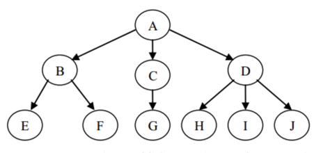
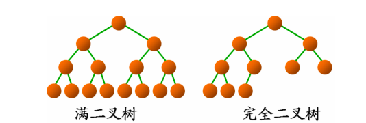

### 树的定义

树是n(n>=0)个结点的有限集。使用递归定义：

（1）或者是一棵空树（n=0），空树中不包含任何结点

（2）或者是一棵非空树（n>0），此时有且仅有一个特定的称为 根（root） 的结点；当n>1时，其余结点可以分为m(m>0)个互不相交的有限集T1,T1,…,Tm，其中每一个本身又是一棵树，并且称为根的 子树（sub tree）

### 二叉树

二叉树定义：二叉树的每个结点至多只有二棵子树(不存在度大于2的结点)，二叉树的子树有左右之分，次序不能颠倒。

满二叉树：除最后一层无任何子节点外，**每一层上的所有结点都有两个子结点**。

完全二叉树：若设二叉树的深度为h，除第 h 层外，其它各层 (1～(h-1)层) 的结点数都达到最大个数，第h层所有的结点都连续集中在最左边，这就是完全二叉树。

### 二叉搜索树

二叉搜索树，满足以下定义：

1) 若左子树不空，则左子树上所有结点的值均小于它的根结点的值；
2) 若右子树不空，则右子树上所有结点的值均大于或等于它的根结点的值；
3) 左、右子树也分别为二叉排序树；

具有以下性质：

1) 对二叉查找树进行中序遍历，即可得到有序的数列。
2) 它和二分查找一样，插入和查找的时间复杂度均为O(logn)，但是在最坏的情况下仍然会有O(n)的时间复杂度。
3) 二叉查找树的高度决定了二叉查找树的查找效率。

### 平衡二叉树

平衡二叉树定义：它是一 棵空树或它的左右两个子树的高度差的绝对值不超过1，并且左右两个子树都是一棵平衡二叉树。

### 练习

二叉树本身就是使用递归来定义，解决二叉树的问题，也可以递归的方法。

leetcode 104 111 226 100 101 202 222 110 112 404